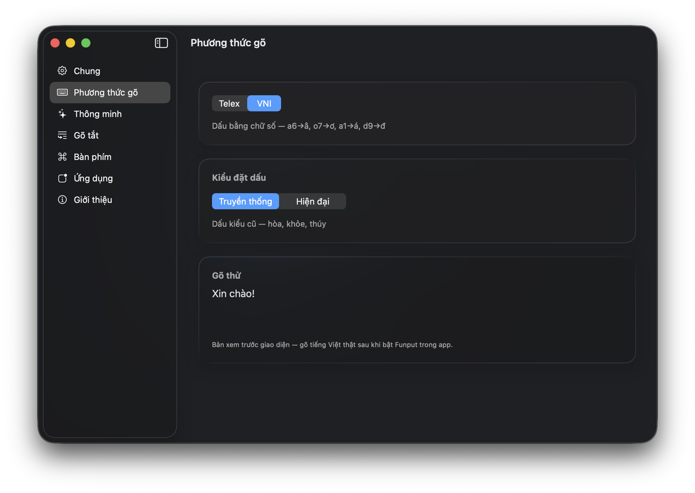

  <strong>Tiếng Việt</strong> · <a href="README.en.md">English</a>

  

<pre align="center">
   ███████╗██╗   ██╗███╗   ██╗██████╗ ██╗   ██╗████████╗
   ██╔════╝██║   ██║████╗  ██║██╔══██╗██║   ██║╚══██╔══╝
█████╗  ██║   ██║██╔██╗ ██║██████╔╝██║   ██║   ██║
██╔══╝  ██║   ██║██║╚██╗██║██╔═══╝ ██║   ██║   ██║
██║     ╚██████╔╝██║ ╚████║██║     ╚██████╔╝   ██║
╚═╝      ╚═════╝ ╚═╝  ╚═══╝╚═╝      ╚═════╝    ╚═╝
</pre>

---

**Funput** là bộ gõ tiếng Việt mã nguồn mở, hiện đã phát hành trên macOS,
Windows và Linux, đang được phát triển cho Android và dự kiến hỗ trợ iOS. Mọi
nền tảng dùng chung một lõi xử lý để giữ hành vi gõ nhất quán.

## Bắt đầu

  
  
  

## Nền tảng hỗ trợ

  
  
  
   
  
  

## Giao diện

  
   
  Tuỳ chỉnh phương thức gõ, kiểu đặt dấu và các tính năng thông minh trên macOS.

## Phản hồi gần như tức thời

Funput xử lý mỗi phím trong khoảng **1,5 micro giây** — tương đương khoảng
**650.000 phím mỗi giây**. Với tốc độ gõ thông thường chỉ vài phím mỗi giây, độ
trễ của engine gần như không thể cảm nhận và không trở thành nút thắt trong trải
nghiệm nhập liệu.

| Component / API | Phạm vi đo | Telex | VNI |
|---|---|---:|---:|
| [`funput-core::apply_checked`](crates/funput-core) | Lõi biến đổi Telex/VNI | 0,230 µs/phím | 0,204 µs/phím |
| [`funput-engine::Engine::process_char`](crates/funput-engine) | Pipeline đầy đủ, gồm boundary và English restore | 1,50 µs/phím | 1,53 µs/phím |
| [`funput-ffi::{funput_process_char, funput_buffer}`](crates/funput-ffi) | Engine qua C ABI và đọc composed buffer | 1,54 µs/phím | 1,53 µs/phím |

> Kết quả được đo với release build trên máy Apple M-series. Số liệu bao gồm phần
> xử lý của Funput, không bao gồm thời gian chuyển sự kiện bàn phím của hệ điều hành
> hoặc render của ứng dụng đích.

Xem [phương pháp đo, mã benchmark và cách tái lập](benchmarks/README.md).

## Trạng thái

Funput đang được phát triển tích cực. Tính năng và kiến trúc có thể tiếp tục thay đổi trong các phiên bản đầu.

Bug report, thảo luận và đóng góp đều được chào đón.

## License

[MIT](LICENSE) — © Funput
